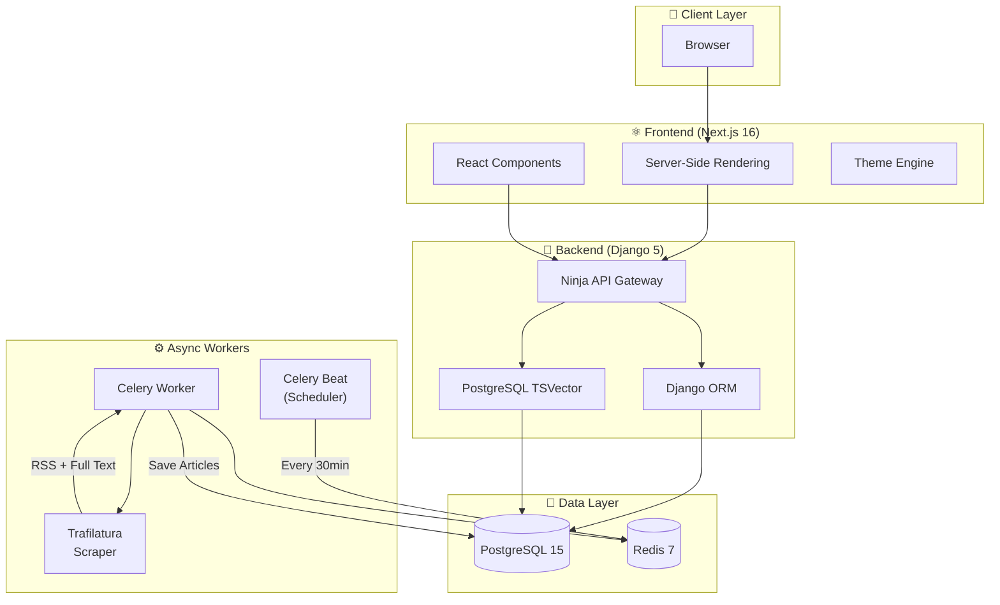
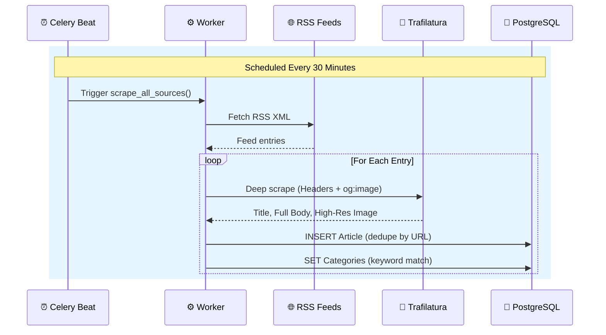

# 📰 ULTRA-NEWS V2

> **The Information Instrument.** A production-grade news aggregation platform engineered for density, speed, and clarity.


---

## 🧠 Engineering Philosophy

### The Problem
Modern news aggregators suffer from **information overload**—cluttered card layouts, intrusive ads, and poor signal-to-noise ratios. Users want information density without cognitive fatigue.

### Our Solution
ULTRA-NEWS is designed as an **Information Instrument**—not just a feed, but a calm, intelligent interface optimized for rapid consumption and deep reading.

| Principle | Implementation |
|-----------|----------------|
| **Information Density** | List-based feed (no cards), aggressive whitespace management |
| **Zero Friction** | Keyboard shortcuts (⌘K search), instant dark mode toggle |
| **Source Transparency** | Every article shows source + timestamp, links to original |
| **Performance First** | Database-level search (no ElasticSearch), edge caching |

---

## ✨ Key Features

*   **Hybrid Design System**: 70% editorial authority (Wired/The Verge) / 30% calm utility.
*   **Professional Content Strategy**:
    *   **High-Res Imagery**: Automatic `og:image` extraction for sharp 21:9 hero assets.
    *   **Deep Fetching**: Browser-grade scraper bypasses bot blocks to retrieve full content (400+ words).
*   **Performance UX**:
    *   **Skeleton Loading**: Premium "pulsing" states for perceived speed.
    *   **Pagination**: Efficient `limit/offset` API with editorial-style controls.
*   **Production Ready**: Docker-native, split frontend/backend architecture, Vercel + Railway optimized.

---

## 🎨 Design System

We follow a **70/30 Hybrid Rule**: 70% editorial authority (Wired/The Verge), 30% calm utility (BBC/Apple News).

### Visual Language

```
┌─────────────────────────────────────────────────────────────┐
│  TYPOGRAPHY                                                 │
│  ─────────                                                  │
│  Headlines: Inter Display (Bold, -0.04em tracking)          │
│  Body: Inter (Regular, optimized for small sizes)           │
│                                                             │
│  COLORS                                                     │
│  ──────                                                     │
│  Background: #FFFFFF (light) / #000000 (dark)               │
│  Foreground: #000000 (light) / #FFFFFF (dark)               │
│  Accent: #2563EB (Royal Blue) — interactions only           │
│                                                             │
│  COMPONENTS                                                 │
│  ──────────                                                 │
│  • Editorial Lists (clean borders, no shadows)              │
│  • Cinematic Hero (21:9 aspect, bold type)                  │
│  • Minimalist Navbar (wordmark only)                        │
└─────────────────────────────────────────────────────────────┘
```

---

## 🏗 System Architecture



---

## 🌊 Data Flow

### Article Ingestion Pipeline



---

## 🚀 Deployment Guide

This project is Docker-native and can be deployed to any VPS (DigitalOcean, AWS, Hetzner) or PaaS.

See [DEPLOYMENT.md](DEPLOYMENT.md) for a detailed, step-by-step guide for Vercel (Frontend) + Railway (Backend).

### Option A: Standard VPS (Recommended)
*Best for: Full control, lowest cost, keeping database and app together.*

1.  **Provision a Server**: Ubuntu 22.04 LTS (minimum 2GB RAM).
2.  **Install Docker**:
    ```bash
    curl -fsSL https://get.docker.com | sh
    ```
3.  **Clone & Configure**:
    ```bash
    git clone https://github.com/yourusername/ultra-news.git
    cd ultra-news
    cp backend/.env.example backend/.env
    # Edit .env with production secrets (SECRET_KEY, DB credentials)
    ```
4.  **Run Production Build**:
    ```bash
    make build
    make up
    ```
5.  **Set up Nginx (Reverse Proxy)**:
    Install Nginx and point port 80 to `localhost:3000`.

---

## 🚀 Quick Start (Local)

```bash
# 1. Clone & Start
git clone https://github.com/emmanuelrichard01/ULTRA-NEWS.git
cd ULTRA-NEWS
make up

# 2. Initialize Data
make migrate
make seed
make seed-sources       # Seeds professional sources (Wired, Verge, etc.)
make assign-categories

# 3. Access
# Frontend: http://localhost:3000
# API Docs: http://localhost:8000/api/docs
```

---

## 📄 License

MIT License © 2024 Ultra News
