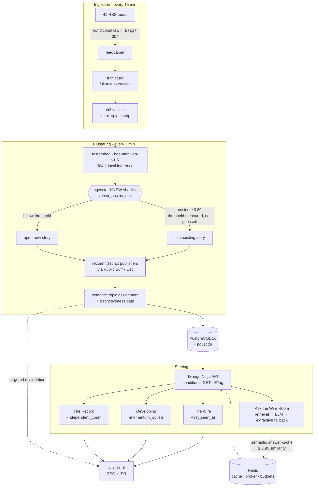
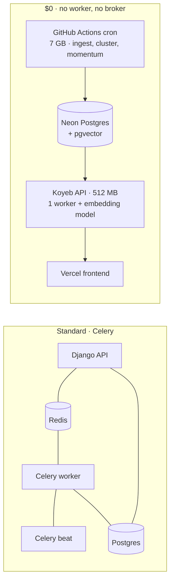

# ULTRA-NEWS V3 — The Wire Room

> **Story-centric news intelligence.** Multiple outlets covering the same event, collapsed into one verified cluster — so you see the full picture, not just one outlet's take.


---

## What This Is

Ultra News is a news aggregation platform built around a single architectural bet: **stories, not articles, are the primary entity.** When Reuters, BBC, and The Guardian all cover the same event, their articles are semantically clustered into one `Story` object with an explicit source count, a verification lifecycle status, and a velocity score tracking how fast coverage is accumulating.

Coverage is presented as three **editions** — each a different ordering of the
whole corpus rather than a slice of it, so none can run dry:

| Edition | Ordering | What it answers |
| ------ | -------- | --------- |
| **The Wire** | Newest first | What just landed? |
| **Developing** | Independent outlets gained in the last 12h | What is gaining corroboration *right now*? |
| **The Record** | Weight of independent corroboration | What do multiple newsrooms agree happened? |
| **Topics** | Any edition, filtered | 9 topics, assigned semantically rather than by keyword. |

Corroboration is a **filter and a signal on every card**, not a destination. An
earlier design split these as three separate feeds by a static count, which put
95% of stories on one page and left the other two permanently near-empty.

"Developing" ranks by outlets that picked a story up inside a rolling window, so
a story appears while coverage is accelerating and leaves once it settles.

---

## Architecture at a Glance

Three things distinguish this from an RSS reader, and all three live in the
clustering step: articles are matched **semantically** rather than by title,
corroboration counts **distinct publishers** rather than articles, and the
editions are **orderings of one corpus** rather than separate collections.


```mermaid
flowchart TB
    subgraph ING["Ingestion · every 15 min"]
        direction LR
        FEEDS["41 RSS feeds"] -->|"conditional GET · ETag / 304"| PARSE["feedparser"]
        PARSE --> FETCH["trafilatura<br/>full-text extraction"]
        FETCH --> CLEAN["nh3 sanitise<br/>+ boilerplate strip"]
    end

    subgraph CLU["Clustering · every 3 min"]
        direction TB
        EMBED["fastembed · bge-small-en-v1.5<br/>384d, local inference"]
        ANN{{"pgvector HNSW shortlist<br/>vector_cosine_ops"}}
        JOIN["join existing story"]
        NEW["open new story"]
        COUNT["recount distinct publishers<br/>via Public Suffix List"]

        EMBED --> ANN
        ANN -->|"cosine ≥ 0.80<br/>threshold measured, not guessed"| JOIN
        ANN -->|"below threshold"| NEW
        JOIN --> COUNT
        NEW --> COUNT
        COUNT --> TOPIC["semantic topic assignment<br/>+ distinctiveness gate"]
    end

    subgraph SRV["Serving"]
        direction TB
        API["Django Ninja API<br/>conditional GET · ETag"]
        WIRE["The Wire<br/>-first_seen_at"]
        DEV["Developing<br/>-momentum_outlets"]
        REC["The Record<br/>-independent_count"]
        ASK["Ask the Wire Room<br/>retrieval → LLM → extractive fallback"]

        API --> WIRE & DEV & REC
        API --> ASK
    end

    PG[("PostgreSQL 16<br/>+ pgvector")]
    RD[("Redis<br/>cache · broker · budgets")]
    WEB["Next.js 16<br/>RSC + ISR"]

    CLEAN --> EMBED
    TOPIC --> PG
    PG --> API
    RD -.-> API
    ASK -.->|"semantic answer cache<br/>≥ 0.95 similarity"| RD
    WIRE & DEV & REC --> WEB
    TOPIC -.->|"targeted revalidation"| WEB
```

**Why momentum is a stored column.** It decays with the clock, not with writes:
a story that drew ten outlets thirteen hours ago has zero momentum now, and
nothing touched its row to say so. A periodic sweep recomputes what is still
inside the window and bulk-zeroes what has aged out — which is why it is a
materialised value rather than a cache. Computing it per request cost 251 ms;
reading the column costs 7.6 ms.

### Deployment topologies

The same codebase runs in two shapes. On the free path the batch work moves to
CI runners, because that is where the memory is.


```mermaid
flowchart LR
    subgraph PAID["Standard · Celery"]
        direction TB
        B1["Django API"] --- R1[("Redis")]
        R1 --- W1["Celery worker"]
        W1 --- BEAT["Celery beat"]
        W1 --- D1[("Postgres")]
        B1 --- D1
    end

    subgraph FREE["$0 · no worker, no broker"]
        direction TB
        GA["GitHub Actions cron<br/>7 GB · ingest, cluster, momentum"]
        B2["Koyeb API · 512 MB<br/>1 worker + embedding model"]
        D2[("Neon Postgres<br/>+ pgvector")]
        V2["Vercel frontend"]
        GA --> D2
        D2 --> B2
        B2 --> V2
    end
```

| Layer | Technology | Why |
| ------- | ----------- | ----- |
| **API** | Django Ninja | Typed, fast, auto-documented. Better than DRF for this scope. |
| **Clustering** | pgvector + fastembed (`bge-small-en-v1.5`, 384d) | Local ML inference. No API costs. Cosine similarity > exact title match. |
| **Frontend** | Next.js 16 (RSC + App Router) | Server components for data; ISR for caching. |
| **Processing** | Celery + Redis | Proper task queue. Retry, monitoring, no raw threading. |
| **Sanitization** | nh3 (Rust-based) | Closes the stored XSS vector from `dangerouslySetInnerHTML`. |
| **Search** | PostgreSQL `SearchVectorField` + GIN, maintained by a DB trigger | Pragmatic. The trigger means the vector cannot drift from the row whichever path writes it. |

### Data Model

```
Source ──┐
         ├── Article ──→ Story (cluster)
         └── RawDocument (1:1 with Article, internal-only full text)

Story ──→ [wire | developing | corroborated]
       ──→ velocity_score (independent outlets/hour)
       ──→ independent_count (unique PUBLISHERS — two feeds from one
           newsroom count once; a newsroom cannot corroborate itself)
       ──→ embedding (384d vector, cluster centroid)
```

- **`Source`** — RSS feed config with tier/region metadata + health tracking (consecutive failures, last_fetched_at).
- **`Story`** — The primary entity. A real-world event with source_count, independent_count, velocity, status.
- **`Article`** — Individual piece from one source. Excerpt-only display (~40 words) + outbound link.
- **`RawDocument`** — Full extracted text. Internal-only. Powers embeddings and future AI summarization.

### Key Trade-offs

| Decision | What we chose | What we rejected | Why |
| ---------- | -------------- | ----------------- | ----- |
| Clustering | Semantic vectors, cosine ≥ 0.80 | Exact title match | Three outlets write three headlines for one event. The threshold is set by measurement (`manage.py calibrate_threshold`) above every different-event pair in the labelled set — it prefers missing a merge to inventing one. |
| Embedding model | `bge-small-en-v1.5` (384d, local) | Larger models; API embeddings | Zero API cost, runs in Docker. Benchmarked against 768d/1024d alternatives (`manage.py benchmark_embeddings`) — they scored *worse* separation on our labelled pairs, so bigger is not better here. |
| Pagination | Cursor on `(first_seen_at, id)` | Cursor on velocity/score | Only immutable keys can paginate. Ranking scores are rewritten by clustering, so paging them repeats and drops rows; ranked editions are capped snapshots instead. |
| Display model | Excerpt-only (~40 words) | Full article rendering | We're an aggregator, not a publisher. Outbound links respect the source. |
| Auth (ingest) | GitHub OIDC JWT | Static API key alone | Key rotation without redeployment. Verifiable identity chain. |

---

## API Endpoints

All under `/api/v1/`:

| Endpoint | Method | Auth | Description |
| ---------- | -------- | ------ | ------------- |
| `/stories` | GET | — | List stories. `sort=latest\|momentum\|significance`, `min_sources`, `category`. Only `latest` paginates — ranking keys are mutable. |
| `/stories/{slug}` | GET | — | Story detail: all contributing articles, timeline, framing, independent_count, velocity_score. |
| `/stories/{slug}/related` | GET | — | Semantically related stories via pgvector similarity search. |
| `/news` | GET | — | List articles. Full-text search via `q=`, category filter. |
| `/articles/{slug}` | GET | — | Single article detail (excerpt + outbound link). |
| `/sources` | GET | — | Source registry: all feeds with tier, region, health, article counts. |
| `/ask` | POST | — | Question answering over clustered reporting. Story-level retrieval, semantic answer cache, degrades to source-derived output without a model. |
| `/health` | GET | — | DB, cache, ingest freshness, clustering backlog, failing sources. **Returns 503 when degraded.** |
| `/metrics` | GET | Token/IP | Prometheus metrics. Access-controlled. |
| `/feeds/{wire,developing,record}.xml` | GET | — | Outbound RSS, one per edition. Each item states its corroboration level. |
| `/admin/trigger-ingest` | POST | OIDC JWT | Trigger Celery ingestion via GitHub Actions. |
| `/admin/seed-db` | POST | API Key | Seed categories + sources from the source registry. |

---

## Quick Start

```bash
# 1. Clone & build
git clone https://github.com/emmanuelrichard01/ULTRA-NEWS.git
cd ULTRA-NEWS
make setup    # builds, starts, migrates, seeds

# 2. Access
# Frontend:  http://localhost:3000
# API Docs:  http://localhost:8000/api/v1/docs

# 3. Trigger first ingestion
make ingest
```

### Developer Commands

```bash
make help           # Show all commands
make status         # Service health check
make logs           # Tail all service logs
make logs-backend   # Backend only
make logs-worker    # Worker only
make logs-frontend  # Frontend only
make shell          # Django shell
make db-shell       # PostgreSQL shell (psql)
make lint           # Run linters (ruff + tsc)
make test           # Run all tests
make restart        # Restart all services
make clean          # Stop services, remove containers
make nuke           # ⚠️ Stop services + delete all data
```

---

## Environment Variables

Copy `.env.example` to `.env` and configure:

### Backend

| Variable | Required | Description |
| :--- | :---: | :--- |
| `SECRET_KEY` | ✅ | Django security key. **The app refuses to start when `DEBUG=0` and this is unset** rather than falling back to a default key committed to this repo. |
| `DEBUG` | ✅ | `1` for dev, `0` for production |
| `ALLOWED_HOSTS` | ✅ | Comma-separated hostnames |
| `ADMIN_API_KEY` | ✅ | API key for admin endpoints (compared in constant time) |
| `DATABASE_URL` | ✅ | PostgreSQL connection string |
| `REDIS_URL` | ✅ | Redis connection string |
| `CELERY_BROKER_URL` | ✅ | Celery broker (same as REDIS_URL) |
| `CELERY_RESULT_BACKEND` | ✅ | Celery results (same as REDIS_URL) |
| `FRONTEND_URL` | ✅ | Frontend URL (for CORS) |
| `GITHUB_OIDC_REPOSITORY` | ⚠️ | `owner/repo` allowed to call OIDC-authenticated admin endpoints. **Without it OIDC auth is refused outright** — a valid GitHub Actions token only proves the request came from GitHub, not from *your* workflow. |
| `TRUST_PROXY_HEADERS` | — | `1` only when behind a proxy that overwrites `X-Forwarded-For`. Off by default so rate limiting keys off `REMOTE_ADDR`, which a client cannot forge. |
| `TRUSTED_PROXY_COUNT` | — | Proxy hops in front of the app (default `1`). |
| `NEXTJS_URL` | — | Next.js origin for on-demand cache purges. Blank disables revalidation. |
| `REVALIDATE_SECRET` | — | Shared secret for the purge webhook. Must match the frontend. |
| `LLM_API_KEY` | — | Google Gemini key. Without it, `/ask` and story briefs degrade to extractive summaries instead of failing. |
| `MAX_ASK_DAILY_REQUESTS` | — | Daily `/ask` spend ceiling (default `500`). |
| `MAX_SYNTHESIS_DAILY_REQUESTS` | — | Daily background-synthesis ceiling (default `200`). |

### Frontend

| Variable | Required | Description |
| :--- | :---: | :--- |
| `NEXT_PUBLIC_API_URL` | ✅ | Backend API URL (no trailing slash) |
| `NEXT_PUBLIC_APP_URL` | — | Public app URL (for meta tags) |
| `REVALIDATE_SECRET` | — | Must match the backend. The purge route returns 503 when unset — it fails closed. |
| `IMAGE_HOST_ALLOWLIST` | — | Comma-separated `next/image` host allowlist. Defaults to the CDNs used by the source registry. Never set to `**` — that makes the deployment an open image proxy. |

---

## Observability

`/metrics` exposes Prometheus metrics (access-controlled — see
`METRICS_TOKEN` / `METRICS_ALLOWED_IPS`). `/api/v1/health` returns 503 when
degraded, so uptime checks work without parsing the body.

The metric to alert on first is **`ultranews_articles_pending_clustering`**.
Articles are invisible to readers until clustered, so a rising backlog means the
product is quietly going stale while every request still returns 200 — no
request-level check reveals it.

| Signal | Metric |
| :--- | :--- |
| Clustering falling behind | `ultranews_articles_pending_clustering` |
| Feeds breaking | `ultranews_ingest_outcomes_total{outcome="failure"}` |
| Primary model degrading | `ultranews_llm_calls_total{outcome="fallback"}` |
| Inference cost | `ultranews_answer_cache_total{result="hit"}` |
| Latency by route | `ultranews_http_request_seconds` |

Every response carries `X-Request-ID`, bound into structlog's context, so JSON
logs for one request can be grouped in an aggregator. An upstream
`X-Request-ID` is honoured so the id spans the proxy.

Error tracking via Sentry is optional and off unless `SENTRY_DSN` is set.

## Testing

```bash
cd backend && python -m pytest -q      # or: make test
```

Migrations **must** run for the suite — parts of the schema exist only as
migrations, not as model state (`0006` installs pgvector, `0013` installs the
`search_vector` trigger). `pytest.ini` therefore does not pass `--nomigrations`.

---

## Project Status

Verified on a live stack: **104 tests passing**, 41/41 feeds healthy, clean
typecheck, zero lint errors.

### Working

- Semantic clustering with a threshold calibrated against real data
- Corroboration measured in **independent publishers**, resolved via the Public
  Suffix List — two feeds from one newsroom count once
- Three editions, each an ordering of the whole corpus
- Story pages: verification statement, conflicts-first brief, corroboration
  timeline, pickup-pattern chart, framing matrix, source ledger
- Semantic topic classification (98% coverage, up from 53% with keywords)
- Source health with circuit breaker, conditional GET and transient-error retry
- Question answering with story-level retrieval and a semantic answer cache
- Outbound RSS per edition
- Tiered retention, Prometheus metrics, request correlation

### Known limits

- **Vocabulary-divergent paraphrases don't merge.** "CBN holds rates" and "Apex
  Bank keeps policy unchanged" stay separate. Larger embedding models score
  *worse* separation (`manage.py benchmark_embeddings`), so this needs
  entity-aware matching rather than more dimensions.
- **Publisher independence is inferred from domains**, so outlets under common
  ownership count separately.
- **Topic classification is semantic, not editorial**, and misfiles near
  category boundaries.
- Coverage skews toward English-language feeds.

See [docs/ROADMAP.md](docs/ROADMAP.md) for what is deliberately not done, and
why.

---

## License

MIT License © 2025 Ultra News
