# 📰 ULTRA-NEWS V2

> **The Information Instrument.** A production-grade news aggregation platform engineered for density, speed, and clarity.


---

## 🧠 Engineering Philosophy

### The Problem
Modern news aggregators suffer from **information overload**—cluttered card layouts, intrusive ads, and poor signal-to-noise ratios. Users want information density without cognitive fatigue.

### Our Solution
ULTRA-NEWS is designed as an **Information Instrument**—not just a feed, but a calm, intelligent interface optimized for rapid consumption and deep reading.

| Principle | Implementation |
|-----------|----------------|
| **Information Density** | List-based feed (no cards), aggressive whitespace management |
| **Zero Friction** | Keyboard shortcuts (⌘K search), instant dark mode toggle |
| **Source Transparency** | Every article shows source + timestamp, links to original |
| **Performance First** | Database-level search (no ElasticSearch), edge caching |

---

## 🎨 Design System

We follow a **70/30 Hybrid Rule**: 70% editorial authority (Wired/The Verge), 30% calm utility (BBC/Apple News).

### Visual Language

```
┌─────────────────────────────────────────────────────────────┐
│  TYPOGRAPHY                                                 │
│  ─────────                                                  │
│  Headlines: Inter Display (Bold, -0.02em tracking)          │
│  Body: Inter (Regular, optimized for small sizes)           │
│                                                             │
│  COLORS                                                     │
│  ──────                                                     │
│  Background: #FAFAFA (light) / #09090B (dark)               │
│  Foreground: #0A0A0A (light) / #FAFAFA (dark)               │
│  Accent: #4F46E5 (Electric Indigo) — interactions only      │
│                                                             │
│  COMPONENTS                                                 │
│  ──────────                                                 │
│  • Glass Navbar (backdrop-blur, subtle borders)             │
│  • Elevated Cards (shadow-card, hover lift)                 │
│  • Cinematic Images (21:9 aspect, gradient overlays)        │
└─────────────────────────────────────────────────────────────┘
```

---

## 🏗 System Architecture


---

## 🌊 Data Flow

### Article Ingestion Pipeline

```mermaid
sequenceDiagram
    participant Beat as ⏰ Celery Beat
    participant Worker as ⚙️ Worker
    participant RSS as 🌐 RSS Feeds
    participant Traf as 📄 Trafilatura
    participant DB as 💾 PostgreSQL

    rect rgb(230, 245, 255)
        Note over Beat,DB: Scheduled Every 30 Minutes
        Beat->>Worker: Trigger scrape_all_sources()
        Worker->>RSS: Fetch RSS XML
        RSS-->>Worker: Feed entries
        
        loop For Each Entry
            Worker->>Traf: Extract full content
            Traf-->>Worker: Title, Body, Image
            Worker->>DB: INSERT Article (dedupe by URL)
            Worker->>DB: SET Categories (keyword match)
        end
    end
```



### User Request Flow

```mermaid
sequenceDiagram
    participant User as 👤 User
    participant Next as ⚛️ Next.js
    participant API as 🐍 Django API
    participant Cache as 💨 Redis Cache
    participant DB as 💾 PostgreSQL

    User->>Next: GET /tech
    Next->>API: GET /api/news?category=tech
    
    alt Cache Hit
        API->>Cache: Check cache key
        Cache-->>API: Cached response
    else Cache Miss
        API->>DB: SELECT * WHERE category='tech'
        DB-->>API: Articles[]
        API->>Cache: SET cache (5min TTL)
    end
    
    API-->>Next: JSON Response
    Next-->>User: Rendered HTML
```



---

## 📦 Tech Stack

### Backend
| Component | Technology | Purpose |
|-----------|------------|---------|
| Framework | Django 5.0 | ORM, migrations, admin |
| API | Django Ninja | Type-safe endpoints with Pydantic |
| Database | PostgreSQL 15 | ACID + full-text search (`TSVector`) |
| Queue | Celery + Redis | Background task processing |
| Scraping | Trafilatura + feedparser | Content extraction from RSS |

### Frontend
| Component | Technology | Purpose |
|-----------|------------|---------|
| Framework | Next.js 16 (App Router) | SSR, routing, SEO |
| UI | React 19 + Tailwind v4 | Component architecture |
| Theming | next-themes | Dark mode with system detection |
| Date Handling | date-fns | Relative timestamps |

### Infrastructure
| Component | Technology | Purpose |
|-----------|------------|---------|
| Containers | Docker Compose | Service orchestration |
| Web Server | Uvicorn / Gunicorn | ASGI server |
| Caching | Redis | API response caching |

---

## 🚀 Quick Start

```bash
# 1. Clone and start all services
git clone https://github.com/emmanuelrichard01/ULTRA-NEWS.git
cd ULTRA-NEWS
make up

# 2. Initialize database
make migrate
make seed

# 3. Assign categories to articles
make assign-categories

# 4. Access the app
# Frontend: http://localhost:3000
# API Docs: http://localhost:8000/api/docs
```

---

## 📁 Project Structure

```
ultra-news/
├── Makefile                 # DevOps automation
├── docker-compose.yml       # Container orchestration
│
├── backend/
│   ├── api/
│   │   └── api.py           # Ninja API endpoints
│   ├── core/
│   │   ├── models.py        # Article, Source, Category
│   │   ├── tasks.py         # Celery background tasks
│   │   └── services/
│   │       └── scraper.py   # RSS + Trafilatura logic
│   └── config/
│       ├── settings.py      # Django configuration
│       └── celery.py        # Celery app setup
│
└── frontend/
    ├── app/
    │   ├── page.tsx         # Home feed
    │   ├── [category]/      # Dynamic category pages
    │   └── article/[slug]/  # Article detail
    └── components/
        ├── Navbar.tsx       # Glass morphism nav
        ├── SearchBar.tsx    # ⌘K enabled search
        ├── HeroStory.tsx    # Featured article
        └── FeedItem.tsx     # Article card
```

---

## 🛠 Available Commands

| Command | Description |
|---------|-------------|
| `make up` | Build and start all services |
| `make down` | Stop all containers |
| `make logs` | Stream backend logs |
| `make logs-frontend` | Stream frontend logs |
| `make migrate` | Run database migrations |
| `make seed` | Seed categories |
| `make ingest` | Trigger article scraping |
| `make assign-categories` | Categorize existing articles |
| `make clean` | Full reset (removes volumes) |

---

## 🔮 Roadmap

- [x] **Phase 1**: Foundation (Docker, CI/CD prep)
- [x] **Phase 2**: Core Engine (API, PostgreSQL Search)
- [x] **Phase 3**: Premium UI (Dark mode, Glass effects)
- [x] **Phase 4**: Content Quality (Images, Categories)
- [ ] **Phase 5**: Intelligence (Vector embeddings, "Similar Stories")

---

## 📄 License

MIT License © 2024 Ultra News
