# 📰 ULTRA-NEWS V2

> **The Information Instrument.** A production-grade news aggregation platform engineered for density, speed, and clarity.


---

## 🧠 Engineering Philosophy

### The Problem
Modern news aggregators suffer from **information overload**—cluttered card layouts, intrusive ads, and poor signal-to-noise ratios. Users want information density without cognitive fatigue.

### Our Solution
ULTRA-NEWS is designed as an **Information Instrument**—not just a feed, but a calm, intelligent interface optimized for rapid consumption and deep reading.

| Principle | Implementation |
|-----------|----------------|
| **Information Density** | List-based feed (no cards), aggressive whitespace management |
| **Zero Friction** | Keyboard shortcuts (⌘K search), instant dark mode toggle |
| **Source Transparency** | Every article shows source + timestamp, links to original |
| **Performance First** | Database-level search (no ElasticSearch), edge caching |

---

## ✨ Key Features

*   **Hybrid Design System**: 70% editorial authority (Wired/The Verge) / 30% calm utility.
*   **Professional Content Strategy**:
    *   **Editor's Choice Carousel**: Interactive, auto-playing hero section highlighting top stories with smooth fade transitions.
    *   **High-Res Imagery**: Smart extraction of `og:image` and `twitter:image` tags for sharp 21:9 hero assets, with robust error handling.
    *   **Deep Fetching**: Browser-grade scraper bypasses bot blocks to retrieve full content (400+ words).
*   **Performance UX**:
    *   **High-Contrast Reading**: Optimized typography colors (`gray-950`) for clear legibility in light mode.
    *   **Skeleton Loading**: Premium "pulsing" states for perceived speed.
    *   **Pagination**: Efficient `limit/offset` API with editorial-style controls.
*   **Production Ready**: Docker-native, split frontend/backend architecture, Vercel + Render optimized.

---

## 🎨 Design System

We follow a **70/30 Hybrid Rule**: 70% editorial authority (Wired/The Verge), 30% calm utility (BBC/Apple News).

### Visual Language

```
┌─────────────────────────────────────────────────────────────┐
│  TYPOGRAPHY                                                 │
│  ─────────                                                  │
│  Headlines: Inter Display (Bold, -0.04em tracking)          │
│  Body: Inter (Regular, optimized for small sizes)           │
│                                                             │
│  COLORS                                                     │
│  ──────                                                     │
│  Background: #FFFFFF (light) / #000000 (dark)               │
│  Foreground: #000000 (light) / #FFFFFF (dark)               │
│  Accent: #2563EB (Royal Blue) — interactions only           │
│                                                             │
│  COMPONENTS                                                 │
│  ──────────                                                 │
│  • Editorial Lists (clean borders, no shadows)              │
│  • Cinematic Hero (21:9 aspect, bold type)                  │
│  • Minimalist Navbar (wordmark only)                        │
└─────────────────────────────────────────────────────────────┘
```

---

## 🏗 System Architecture

```mermaid
flowchart TB
    subgraph Client["👤 Client Layer"]
        Browser["Browser"]
    end

    subgraph Frontend["⚛️ Frontend (Next.js 16)"]
        SSR["Server-Side Rendering"]
        React["React Components"]
        Themes["Theme Engine"]
    end

    subgraph Backend["🐍 Backend (Django 5)"]
        Ninja["Ninja API Gateway"]
        ORM["Django ORM"]
        Search["PostgreSQL TSVector"]
    end

    subgraph Data["💾 Data Layer"]
        Postgres[("PostgreSQL 15")]
        Redis[("Redis 7")]
    end

    subgraph Workers["⚙️ Async Workers (Scalable Production)"]
        Beat["Celery Beat\n(Scheduler)"]
        Worker["Celery Worker"]
        Scraper["Trafilatura\nScraper"]
    end
    
    subgraph FreeTier["✨ Free Tier Alternative"]
        Cron["⏰ Cron-Job.org\n(External Trigger)"]
        Thread["Background Thread\n(Inside Django App)"]
    end

    Browser --> SSR
    SSR --> Ninja
    React --> Ninja
    Ninja --> ORM
    ORM --> Postgres
    Ninja --> Search
    Search --> Postgres
    
    %% Standard Path (Recommended)
    Beat -->|"Every 30min"| Redis
    Worker --> Redis
    Worker --> Scraper
    Scraper -->|"RSS + Full Text"| Worker
    Worker -->|"Save Articles"| Postgres

    %% Free Tier Path
    Cron -.->|"POST /trigger-ingest"| Ninja
    Ninja -.->|"Spawn Thread"| Thread
    Thread -.-> Scraper
```



---

## 🌊 Data Flow

### Article Ingestion Pipeline

### Article Ingestion Pipeline
 
We support two ingestion strategies: **Scalable** (Production) and **Free Tier** (Cost-Optimized).

#### Option A: Scalable Production (Recommended)
Uses **Celery + Redis** for robust, distributed background processing.

```mermaid
sequenceDiagram
    participant Beat as ⏰ Celery Beat
    participant Worker as ⚙️ Worker
    participant RSS as 🌐 RSS Feeds
    participant Traf as 📄 Trafilatura
    participant DB as 💾 PostgreSQL

    rect rgb(225, 240, 255)
        Note over Beat,DB: Scheduled Every 30 Minutes
        Beat->>Worker: Trigger scrape_all_sources()
        Worker->>RSS: Fetch RSS XML
        RSS-->>Worker: Feed entries
        
        loop For Each Entry
            Worker->>Traf: Deep scrape (Headers + og:image)
            Traf-->>Worker: Full Content + High-Res Image
            Worker->>DB: INSERT Article
        end
    end
```



#### Option B: Free Tier Alternative (Current)
Uses **Cron-Job.org + Background Threads** to bypass paid worker instances.

```mermaid
sequenceDiagram
    participant Cron as ⏰ Cron Job
    participant API as 🔌 Django API
    participant RSS as 🌐 RSS Feeds
    participant Traf as 📄 Scraper Service

    rect rgb(235, 250, 235)
        Note over Cron,API: Triggered Hourly (External)
        Cron->>API: POST /admin/trigger-ingest
        API-->>Cron: 200 OK (Async Thread Started)
        
        loop For Each Source (Background Thread)
            API->>RSS: Fetch RSS
            API->>Traf: Deep Scrape
        end
    end
```



### 🔄 How It Works (End-to-End)

1.  **Ingestion (The "Brain")**:
    *   Every hour, an external **Cron Job** (Cron-Job.org) hits our secure API endpoint.
    *   The backend spins up a background thread that scrapes configured RSS feeds (Wired, The Verge, etc.).
    *   It bypasses simple RSS summaries by visiting the *actual* article page to extract the **full text** and **high-resolution social images** (`og:image`).
    *   Articles are automatically categorized (e.g., "AI" -> "Tech") and saved to **PostgreSQL**.

2.  **Delivery (The "Fast Lane")**:
    *   When a user visits the site, **Next.js** requests data from the **Django Ninja API**.
    *   The API serves JSON instantly from the database, optimized with search vectors.
    *   The frontend renders the 'Editor's Choice' carousel and editorial lists using **Server Components** for maximum SEO and speed.

3.  **Consumption (The "Experience")**:
    *   Users get a distraction-free reading experience.
    *   **Light Mode**: Sharp, high-contrast typography (`gray-950`).
    *   **Dark Mode**: True OLED black for night reading.
    *   **Mobile**: A native-app-like menu and smooth touch interactions.

---

## 🚀 Deployment Guide

This project is Docker-native and can be deployed to any VPS (DigitalOcean, AWS, Hetzner) or PaaS.

See [DEPLOYMENT.md](DEPLOYMENT.md) for a detailed, step-by-step guide for Vercel (Frontend) + Render (Backend).

### Option A: Standard VPS (Recommended)
*Best for: Full control, lowest cost, keeping database and app together.*

1.  **Provision a Server**: Ubuntu 22.04 LTS (minimum 2GB RAM).
2.  **Install Docker**:
    ```bash
    curl -fsSL https://get.docker.com | sh
    ```
3.  **Clone & Configure**:
    ```bash
    git clone https://github.com/yourusername/ultra-news.git
    cd ultra-news
    cp backend/.env.example backend/.env
    # Edit .env with production secrets (SECRET_KEY, DB credentials)
    ```
4.  **Run Production Build**:
    ```bash
    make build
    make up
    ```
5.  **Set up Nginx (Reverse Proxy)**:
    Install Nginx and point port 80 to `localhost:3000`.

---

## 🚀 Quick Start (Local)

```bash
# 1. Clone & Setup
git clone https://github.com/emmanuelrichard01/ULTRA-NEWS.git
cd ULTRA-NEWS
make setup

# 2. Access
# Frontend: http://localhost:3000
# API Docs: http://localhost:8000/api/docs
```

---

## 📄 License

MIT License © 2024 Ultra News
