# 📰 ULTRA-NEWS V2

> **The Information Instrument.** A production-grade news aggregation platform engineered for density, speed, and clarity.


---

## 🧠 Engineering Philosophy

### The Problem
Modern news aggregators suffer from **information overload**—cluttered card layouts, intrusive ads, and poor signal-to-noise ratios. Users want information density without cognitive fatigue.

### Our Solution
ULTRA-NEWS is designed as an **Information Instrument**—not just a feed, but a calm, intelligent interface optimized for rapid consumption and deep reading.

| Principle | Implementation |
|-----------|----------------|
| **Information Density** | List-based feed (no cards), aggressive whitespace management |
| **Zero Friction** | Keyboard shortcuts (⌘K search), instant dark mode toggle |
| **Source Transparency** | Every article shows source + timestamp, links to original |
| **Performance First** | Database-level search (no ElasticSearch), edge caching |

---

## ✨ Key Features

### Content & Design
*   **Hybrid Design System**: 70% editorial authority (Wired/The Verge) / 30% calm utility
*   **Editor's Choice Carousel**: Interactive, auto-playing hero section with smooth fade transitions
*   **High-Res Imagery**: Smart extraction of `og:image` and `twitter:image` tags for sharp 21:9 hero assets
*   **Deep Fetching**: Browser-grade scraper retrieves full content (400+ words) bypassing bot blocks

### Performance & UX
*   **Edge Caching**: ISR with 60-second revalidation for sub-100ms responses
*   **API Caching**: Redis-backed response caching for article details
*   **Database Indexes**: Optimized queries on `published_date` and `source`
*   **Skeleton Loading**: Premium "pulsing" states for perceived speed
*   **Pagination**: Efficient `limit/offset` API with editorial-style controls

### Production Hardening
*   **API Key Authentication**: Protected admin endpoints with `X-Admin-Key` header
*   **Deep Health Checks**: `/api/health` verifies database and Redis connectivity
*   **Input Validation**: Query length limits and sanitization
*   **Error Boundaries**: Graceful error handling with retry functionality
*   **Docker-native**: Split frontend/backend architecture, Vercel + Render optimized

---

## 🔐 Security Features

| Feature | Implementation |
|---------|----------------|
| **Admin Authentication** | API key via `X-Admin-Key` header |
| **ALLOWED_HOSTS** | Environment-based, no wildcards |
| **DEBUG Mode** | Defaults to `False` in production |
| **CORS** | Explicit origin allowlist |
| **Input Validation** | Query length limits (200 chars) |

---

## 🎨 Design System

We follow a **70/30 Hybrid Rule**: 70% editorial authority (Wired/The Verge), 30% calm utility (BBC/Apple News).

```
┌─────────────────────────────────────────────────────────────┐
│  TYPOGRAPHY                                                 │
│  ─────────                                                  │
│  Headlines: Inter Display (Bold, -0.04em tracking)          │
│  Body: Inter (Regular, optimized for small sizes)           │
│                                                             │
│  COLORS                                                     │
│  ──────                                                     │
│  Background: #FFFFFF (light) / #000000 (dark)               │
│  Foreground: #000000 (light) / #FFFFFF (dark)               │
│  Accent: #2563EB (Royal Blue) — interactions only           │
│                                                             │
│  COMPONENTS                                                 │
│  ──────────                                                 │
│  • Editorial Lists (clean borders, no shadows)              │
│  • Cinematic Hero (21:9 aspect, bold type)                  │
│  • Minimalist Navbar (wordmark only)                        │
└─────────────────────────────────────────────────────────────┘
```

---

## 🏗 System Architecture

```mermaid
flowchart TB
    subgraph Client["👤 Client Layer"]
        Browser["Browser"]
    end

    subgraph Frontend["⚛️ Frontend (Next.js 16)"]
        SSR["Server-Side Rendering"]
        React["React Components"]
        ISR["ISR Cache (60s)"]
    end

    subgraph Backend["🐍 Backend (Django 5)"]
        Ninja["Ninja API Gateway"]
        Auth["API Key Auth"]
        ORM["Django ORM"]
        Search["PostgreSQL TSVector"]
    end

    subgraph Data["💾 Data Layer"]
        Postgres[("PostgreSQL 15")]
        Redis[("Redis 7")]
    end

    subgraph Workers["⚙️ Background Processing"]
        GHA["⏰ GitHub Actions"]
        Thread["Background Thread"]
        Scraper["Trafilatura Scraper"]
    end

    Browser --> SSR
    SSR --> ISR
    ISR --> Ninja
    Ninja --> Auth
    Auth --> ORM
    ORM --> Postgres
    Ninja --> Search
    Search --> Postgres
    Ninja --> Redis
    
    GHA -->|"POST /trigger-ingest"| Auth
    Auth -->|"Spawn Thread"| Thread
    Thread --> Scraper
    Scraper -->|"Save Articles"| Postgres
```



---

## 🌊 Data Flow

### Article Ingestion Pipeline

We support two ingestion strategies: **Scalable** (Production) and **Free Tier** (Cost-Optimized).

#### Option A: Scalable Production (Recommended)
Uses **Celery + Redis** for robust, distributed background processing.


#### Option B: Free Tier Alternative (Current)
Uses **GitHub Actions + Background Threads** to bypass paid worker instances.


### 🔄 How It Works (End-to-End)

1.  **Ingestion (The "Brain")**:
    *   Every 30 minutes, **GitHub Actions** triggers the authenticated API endpoint
    *   Backend spawns a background thread to scrape RSS feeds (Wired, The Verge, etc.)
    *   Deep fetches **full text** and **high-resolution social images** (`og:image`)
    *   Auto-categorizes articles (e.g., "AI" → "Tech") and saves to **PostgreSQL**

2.  **Delivery (The "Fast Lane")**:
    *   **Next.js ISR** caches pages for 60 seconds at the edge
    *   **Redis** caches article detail responses for 5 minutes
    *   **Database indexes** ensure sub-10ms query times

3.  **Consumption (The "Experience")**:
    *   Distraction-free reading with high-contrast typography
    *   **Light Mode**: Sharp, high-contrast (`gray-950`)
    *   **Dark Mode**: True OLED black for night reading
    *   **Mobile**: Native-app-like menu and smooth touch interactions

---

## 🚀 Deployment Guide

This project is Docker-native and can be deployed to any VPS (DigitalOcean, AWS, Hetzner) or PaaS.

See [DEPLOYMENT.md](DEPLOYMENT.md) for a detailed, step-by-step guide for Vercel (Frontend) + Render (Backend).

### Quick Deploy Checklist

1. **Backend (Render)**:
   - Deploy PostgreSQL, Redis, and Django Web Service
   - Set environment variables (see table below)

2. **Frontend (Vercel)**:
   - Deploy from `frontend/` directory
   - Set `NEXT_PUBLIC_API_URL`

3. **GitHub Actions**:
   - Add `INGEST_URL` and `ADMIN_API_KEY` secrets
   - Ingestion runs automatically every 30 minutes

---

## 🚀 Quick Start (Local)

```bash
# 1. Clone & Setup
git clone https://github.com/emmanuelrichard01/ULTRA-NEWS.git
cd ULTRA-NEWS
make setup

# 2. Access
# Frontend: http://localhost:3000
# API Docs: http://localhost:8000/api/docs
```

---

## 🔐 Environment Variables

### Backend (Render/VPS)

| Variable | Required | Description |
|:---|:---:|:---|
| `SECRET_KEY` | ✅ | Django security key (large random string) |
| `DEBUG` | ✅ | Set to `0` for production |
| `ALLOWED_HOSTS` | ✅ | Comma-separated hostnames (e.g., `ultra-news.onrender.com`) |
| `ADMIN_API_KEY` | ✅ | API key for admin endpoints (generate a secure random string) |
| `DATABASE_URL` | ✅ | PostgreSQL connection string |
| `REDIS_URL` | ✅ | Redis connection string |
| `FRONTEND_URL` | ✅ | URL of deployed frontend (for CORS) |

### Frontend (Vercel)

| Variable | Required | Description |
|:---|:---:|:---|
| `NEXT_PUBLIC_API_URL` | ✅ | Public URL of backend API (no trailing slash) |

### GitHub Actions Secrets

| Secret | Description |
|:---|:---|
| `INGEST_URL` | Full trigger endpoint URL |
| `ADMIN_API_KEY` | Same value as Render |

---

## 📄 License

MIT License © 2025 Ultra News
